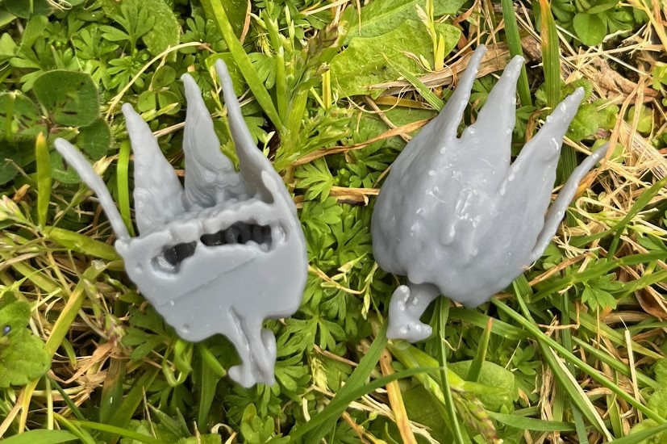
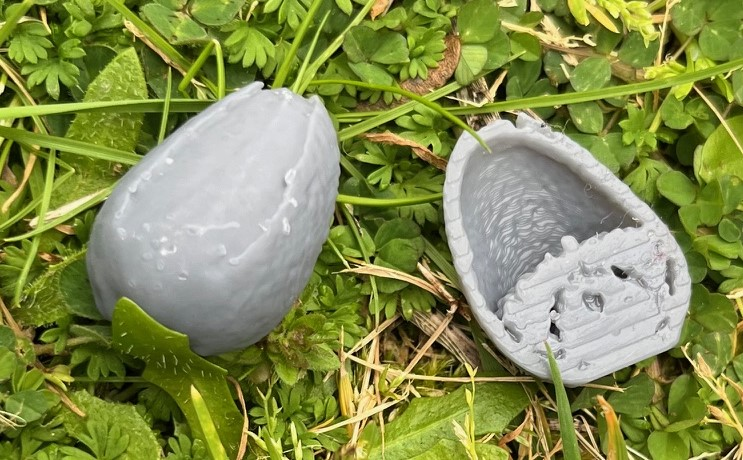
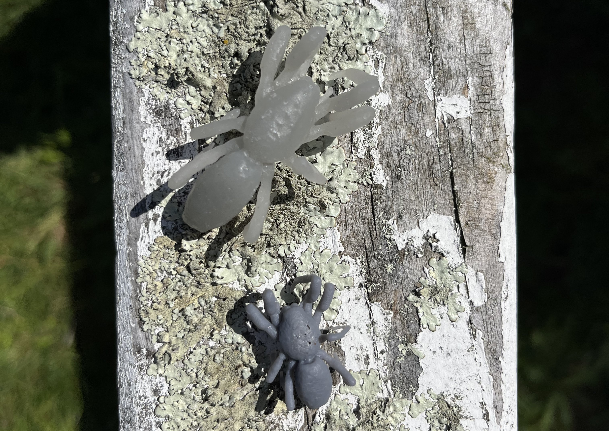

# Resonint 3D Printing Files

A fun collection of files for you to 3D print!

All 3D print files were generated from 3D MRI data collected using the *ilumr* mini desktop MRI system. 

[Learn how to create your own 3D printing files from MRI data](https://www.resonint.com/post/ilumr-from-mri-to-reality "From MRI to Reality Blog Post").

## File Name Reference Guide:

### Flower

### Flower Bud

### Whitetail Spider

